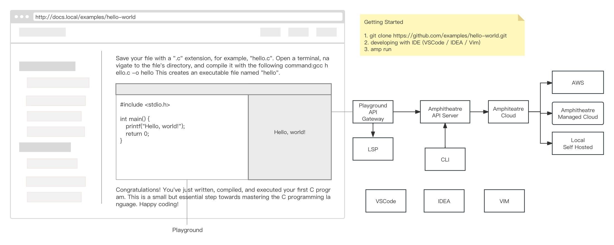

<div align="center">

# Amphitheatre Playground

[](https://github.com/amphitheatre-app/playground/blob/master/LICENSE)
[](https://github.com/amphitheatre-app/playground/graphs/contributors)
[](https://github.com/amphitheatre-app/playground/issues)

[What's it do?](#whats-it-do) •
[Architecture](#architecture) •
[Usage](#usage) •
[Development](#local-development) •
[Contributing](#contributing) •
[简体中文](README.zh-CN.md)

</div>

## What's it do?

Embedded Code runner in web pages, supports multiple programming languages. You
can check demo and read more about features
[here](https://play.amphitheatre.app).

It has a number of features, including:

- A nice, unobtrusive editor with syntax highlighting.
- Supports multiple programming languages, included its build tools.
- The ability to quickly load preview for predefined code from a GitHub Project or Gist.
- See console output in the component itself.

## Architecture

A React frontend communicates with an [Axum
backend](https://github.com/amphitheatre-app/playground-api). Docker containers
are used to provide the various compilers and tools as well as to help isolate
them.



## Usage

The Playground may be included on your site in one of two ways:

### As a React Component

If you are using React, then you can add the
[playground-react](https://github.com/amphitheatre-app/playground-react)
component directly in your project, as simple as the following:

```shell
npm install --save @amphitheatre/playground-react
```

```javascript
import Playground from '@amphitheatre/playground-react'

export default function App() {
  return <Playground style={{ width: 800, height: 500 }} />
}
```

### As an iframe

If you're not using React, please deploy the project and backend server
privately first, then include the Playground in an `iframe`.

```html
<iframe
  width="880"
  height="425"
  frameborder="0"
  src="//playground.your-domain.com/?gist=6b8b99c93be318f254606a92955294ec"
></iframe>
```

#### Parameters

The Playground accepts the following props/parameters.

| Title            | Description                                                  | Default                |
| ---------------- | ------------------------------------------------------------ | ---------------------- |
| **`title`**      | An optional title for the editor pane.                       | `''`                   |
| **`files`**      | A map of `{ [filename]: code }`. This will take precedence over `code` if given. | `undefined`            |
| **`entry`**      | The filename of the file that runs first. This is only relevant when showing multiple files with the `files` parameter. | `''`                   |
| **`initialTab`** | The filename of the tab to show by default. This is only relevant when showing multiple files with the `files` parameter. Defaults to the value of `entry`. | `entry`                |
| **`styles`**     | An map of inline style objects, applied to various elements to customize the style of the UI. Example: `{ header: { backgroundColor: 'red' } }` | `{}`                   |
| **`fullscreen`** | Show a button to enable fullscreen editing (in most configurations of panes). Note that the iframe must have the `allowfullscreen` attribute for this to work. | `false`                |
| **`panes`**      | An array of UI panes to display. To display a pane without options, use a string. Otherwise, use an object with a `type` property. The available panes are: `'stack'`, `'editor'`, `'player'`, `'console'`. Note that there *must be* a `player` pane for any code to run. For pane options, see below. | `['editor', 'player']` |

## Local development

To run the playground locally, run:

- `yarn` to install dependencies
- `yarn build` to compile the app and place it in the `build/` directory
- `yarn start` to serve from the `build/` directory and open a page on your
  browser.

For a fast edit-refresh cycle when developing run `yarn dev`. This will
start an http server and automatically re-compile the TypeScript, HTML and CSS
files whenever they change.

## Local development with Docker-compose

- Make sure you have [docker](https://docs.docker.com/get-docker/) installed.
- Clone or fork this repository.
- Start server `docker-compose up`, add `-d` to `docker-compose up` if you'd
  like to run it in the background.

The first time will take some time to download the dependencies. they are
downloaded only once, and then cached.

## Development with Amphitheatre

Just like the other [Amphitheatre
examples](https://docs.amphitheatre.app/examples/), after [installing the server
and CLI software](https://docs.amphitheatre.app/installation/), and [configuring
the certificates and
preferences](https://docs.amphitheatre.app/getting-started/initialize/), Execute
the following command:

```bash
amp run
```

## Contributing

If anything feels off, or if you feel that some functionality is missing, please
check out the [contributing page](https://docs.amphitheatre.app/contributing/).
There you will find instructions for sharing your feedback, building the tool
locally, and submitting pull requests to the project.


**This project is based on the Web3 Open Source General Playground product
developed by Amphitheatre, which aims to help developers learn Web3 development
better, and is co-sponsored by [Amphitheatre](https://amphitheatre.app/) and
[OpenBuild](https://openbuild.xyz).**

**We will post some development tasks as task topics and label them as "Tasks",
interested partners can evaluate the development time in the corresponding
topics, we will pick the most suitable developer from them and assign the task
to him, and we will give rewards after the task is completed and passes the PR.**

For more information, please refer to [How to
Contribute](https://github.com/amphitheatre-app/playground/blob/master/docs/how_to_contribute.md)
and the [Contribution Reward
Announcement](https://github.com/amphitheatre-app/playground/issues/4).

## Contributors

<!-- readme: collaborators,contributors,zouyuxuan -start -->
<table>
	<tbody>
		<tr>
            <td align="center">
                <a href="https://github.com/lispking">
                    
                    <br />
                    <sub><b>King</b></sub>
                </a>
            </td>
            <td align="center">
                <a href="https://github.com/jueduizone">
                    
                    <br />
                    <sub><b>IanXu</b></sub>
                </a>
            </td>
            <td align="center">
                <a href="https://github.com/GrayJyy">
                    
                    <br />
                    <sub><b>GrayJiang</b></sub>
                </a>
            </td>
            <td align="center">
                <a href="https://github.com/wangeguo">
                    
                    <br />
                    <sub><b>Eguo Wang</b></sub>
                </a>
            </td>
            <td align="center">
                <a href="https://github.com/onlyheartt9">
                    
                    <br />
                    <sub><b>Challenger</b></sub>
                </a>
            </td>
            <td align="center">
                <a href="https://github.com/KazooTTT">
                    
                    <br />
                    <sub><b>KazooTTT</b></sub>
                </a>
            </td>
		</tr>
		<tr>
            <td align="center">
                <a href="https://github.com/dethan3">
                    
                    <br />
                    <sub><b>DEthan3</b></sub>
                </a>
            </td>
            <td align="center">
                <a href="https://github.com/peewee92">
                    
                    <br />
                    <sub><b>Null</b></sub>
                </a>
            </td>
            <td align="center">
                <a href="https://github.com/zouyuxuan">
                    
                    <br />
                    <sub><b>Null</b></sub>
                </a>
            </td>
		</tr>
	<tbody>
</table>
<!-- readme: collaborators,contributors,zouyuxuan -end -->

## License

Copyright (c) The Amphitheatre Authors. All rights reserved.

Licensed under the Apache License, Version 2.0 (the "License"); you may not use
this file except in compliance with the License. You may obtain a copy of the
License at

      https://www.apache.org/licenses/LICENSE-2.0

Unless required by applicable law or agreed to in writing, software distributed
under the License is distributed on an "AS IS" BASIS, WITHOUT WARRANTIES OR
CONDITIONS OF ANY KIND, either express or implied. See the License for the
specific language governing permissions and limitations under the License.
